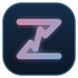
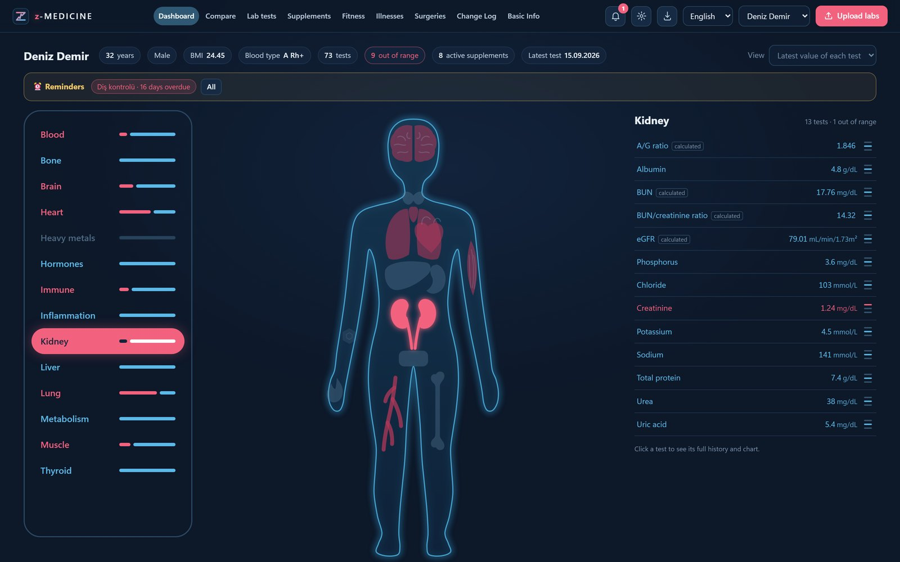
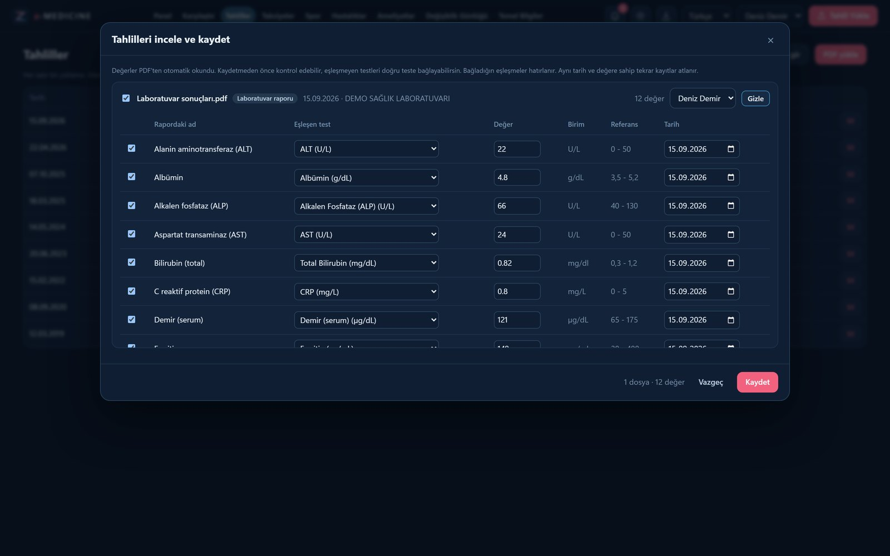
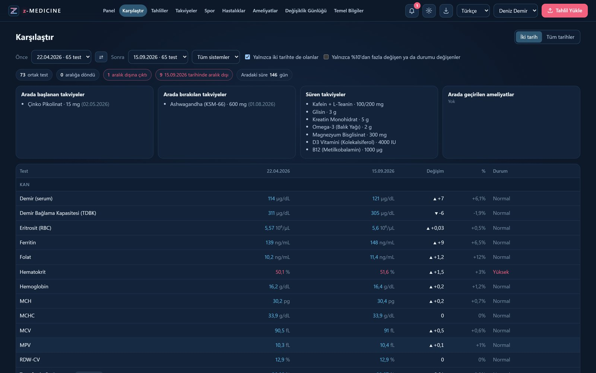
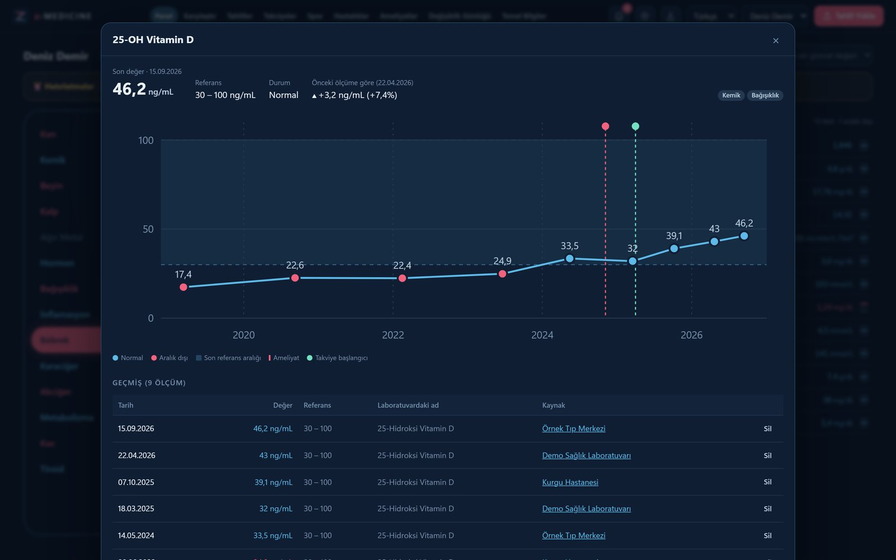
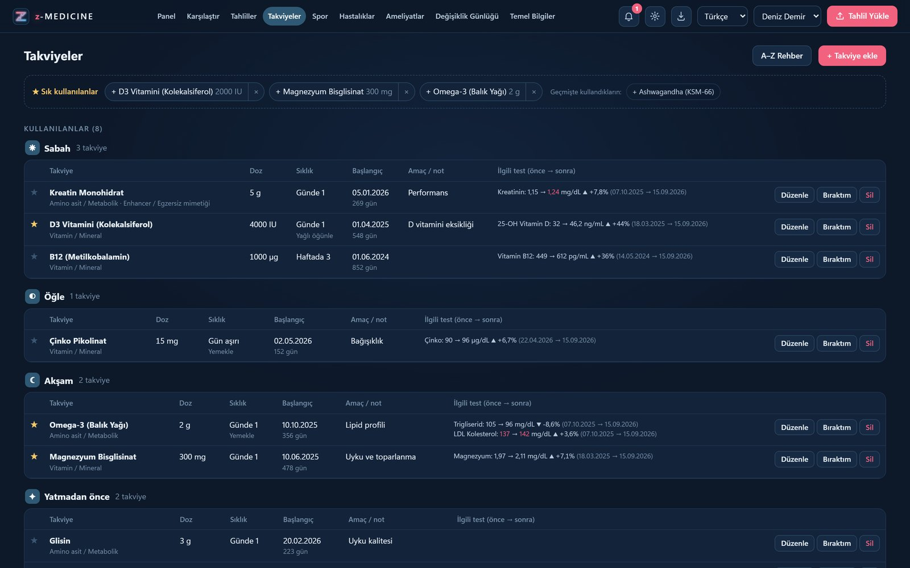
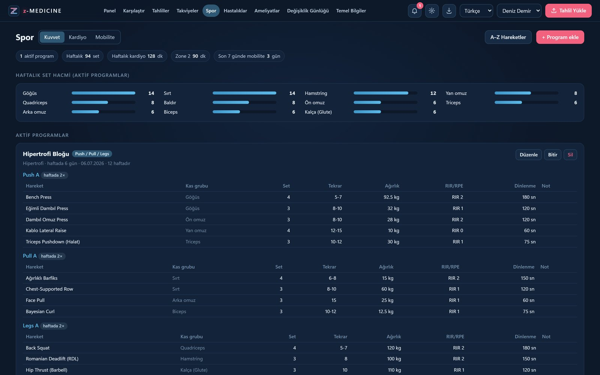
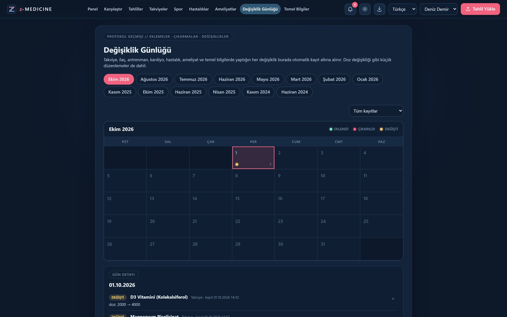
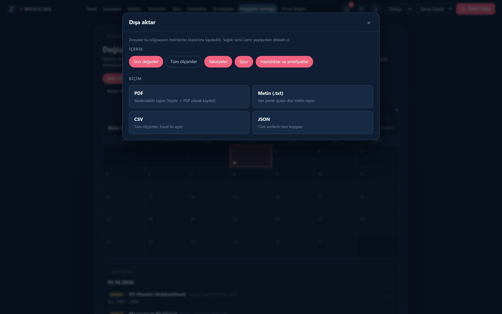
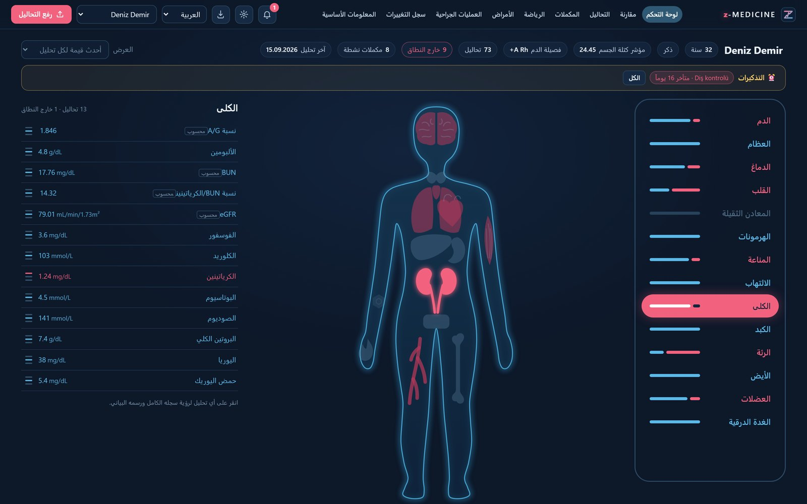

<h1 align="center">z-MEDICINE</h1>

<b>Your lab results, supplements and training — in one private, offline health dashboard.</b> 
Windows 10/11 · 5 languages · 100% local, no account, no cloud

<a href="../../releases/latest"><b>⬇ Download for Windows</b></a>

## Features
- **Body map dashboard:** 14 body systems, each flagged when a marker is out of range.
- **Automatic PDF lab import:** drop in a lab report and values are read for you. Works with Turkish and foreign labs, with SI unit conversion.
- **Trends and comparison:** compare any two dates, or see a marker's full history.
- **Supplements and protocols:** morning, noon, evening and bedtime tables, plus favourites. The A–Z library has 800+ names (supplements, drugs, peptides, bioregulators) and you can add your own.
- **Training:** strength, cardio and mobility logs, plus an A–Z library of 290+ exercises.
- **Illnesses and surgeries:** date, diagnosis, tests, medication and duration.
- **Change log:** every protocol change is recorded automatically and shown in a calendar view.
- **Reminders and backups:** hourly, daily, weekly or monthly backups, with optional sync folder support.
- **Export:** PDF, TXT, CSV or JSON.
- **Languages:** Türkçe · English · Русский · العربية (RTL) · Español.

| | |
|---|---|
|  |  |
|  |  |
|  |  |
|  |  |

*Screenshots use a fictional demo profile.*

## Privacy
All data is stored **only on your computer**, in `%LOCALAPPDATA%\z-MEDICINE`. There are no servers, no accounts and no telemetry.

## Install
1. Download `z-MEDICINE-2.0.0-win64.zip` from [Releases](../../releases/latest) and extract it.
2. Double-click `Kur.cmd`. This needs neither Python nor admin rights.
3. Open z-MEDICINE from the desktop icon.

> The app is not code-signed yet. Windows SmartScreen may warn you; choose **More info → Run anyway**.

## Disclaimer
z-MEDICINE is **not a medical device** and does not give medical advice, diagnosis or treatment. It is for users aged 18 and over. Always consult a qualified healthcare professional.

---

## Türkçe
**z-MEDICINE**, tahlil sonuçlarını, takviyeleri ve sporu tek bir yerde toplayan, tamamen çevrimdışı çalışan bir sağlık panelidir. Hesap ya da bulut gerektirmez.

- **Tahlil PDF'leri:** otomatik okunur. Vücut haritası 14 sistemi gösterir.
- **Karşılaştırma:** iki tarih karşılaştırılabilir veya bir değerin trendi izlenebilir.
- **Takviyeler:** sabah, öğle, akşam ve yatmadan önce tabloları. 800'den fazla ad içeren A–Z rehberi var.
- **Kayıtlar:** spor (kuvvet, kardiyo, mobilite), hastalıklar, ameliyatlar ve değişiklik günlüğü.
- **Yedek ve dışa aktarma:** otomatik yedek, hatırlatmalar ve PDF/CSV dışa aktarma. Arayüz 5 dilde.
- **Gizlilik:** verileriniz yalnızca kendi bilgisayarınızda saklanır.

**Kurulum:** [Releases](../../releases/latest) sayfasından zip dosyasını indirin, klasöre çıkarın ve `Kur.cmd` dosyasına çift tıklayın.

z-MEDICINE tıbbi cihaz değildir ve tıbbi tavsiye vermez. Yalnızca 18 yaş ve üzeri içindir.

---
Contact / İletişim: **blgymtr@gmail.com** · © 2026 z-MEDICINE. All rights reserved.
